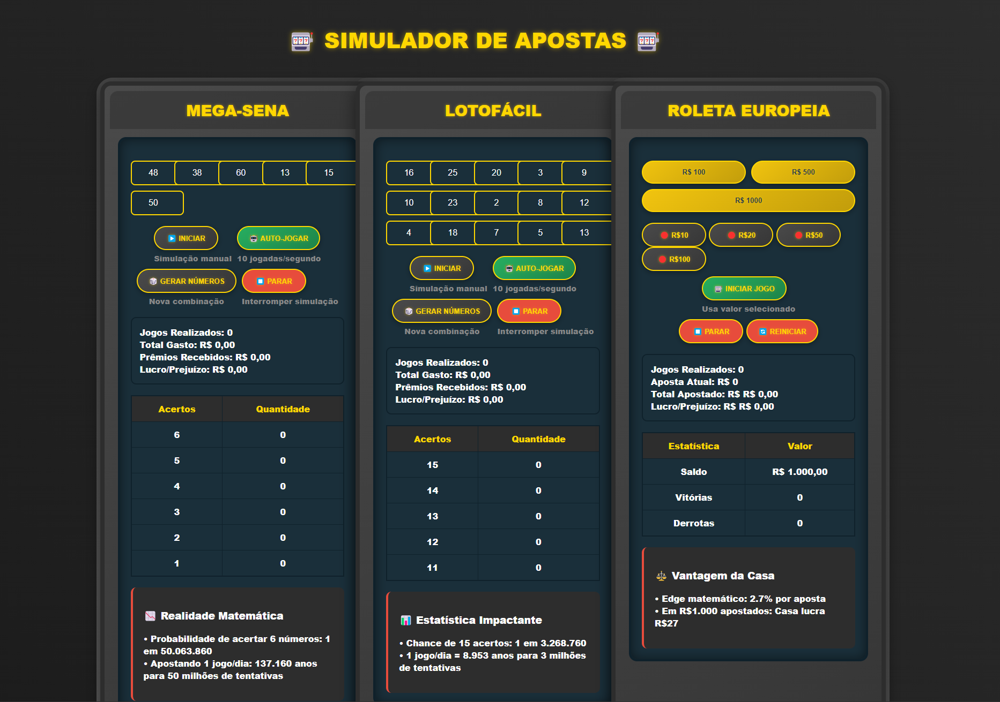

# 🎰 Simulador de Cassinos Didáticos

Um simulador interativo que SIMULA a matemática por trás de jogos de azar populares no Brasil. Desenvolvido para fins educacionais e de conscientização (e para mostrar o poder da IA, especificamente DeepSeek, já que foi desenvolvido 100% por IA através de prompts).

## ✨ Funcionalidades Principais

### 🎱 Mega-Sena
- Geração aleatória de números
- Simulação manual e automática (10 jogadas/segundo)
- Cálculo em tempo real de:
  - Gastos acumulados
  - Prêmios recebidos
  - Probabilidades reais
  - Histórico de acertos

### 🎯 Lotofácil
- Interface com 15 números para seleção
- Auto-jogar com atualização em tempo real
- Estatísticas detalhadas de:
  - Retorno financeiro
  - Distribuição de acertos
  - Tempo necessário para ganhar

### 🎡 Roleta Europeia
- Sistema completo de apostas
- Gestão de saldo virtual
- Demonstração da vantagem da casa (2.7%)
- Controle de:
  - Valor das apostas
  - Histórico de vitórias/derrotas
  - Evolução do patrimônio

## 🚀 Como Usar

1. **Mega-Sena/Lotofácil**
   - Clique em 🎲 Gerar Números para nova combinação
   - ▶️ Iniciar para simulação manual
   - 🤖 Auto-Jogar para simulação automática
   - ⏹️ Parar para interromper

2. **Roleta Europeia**
   - Selecione o valor inicial (R$100, R$500, R$1000)
   - Escolha o valor da aposta (R$10 a R$100)
   - 🎰 Iniciar Jogo para começar
   - Acompanhe o saldo em tempo real
     
OBS.: PARA REINICIAR OS NÚMEROS, BASTA ATUALIZAR A PÁGINA (F5)

## 💡 Recursos Técnicos

- **Design Responsivo**
  - Funciona em qualquer dispositivo
  - Layout adaptável para mobile
  - Efeitos visuais otimizados

- **Estatísticas em Tempo Real**
  - Cálculo instantâneo de probabilidades
  - Atualização automática de resultados
  - Histórico completo de jogos

- **Segurança**
  - Nenhum dado real coletado
  - Simulação 100% local
  - Sem conexão com serviços externos

## 🛠 Tecnologias Utilizadas

- **Frontend**
  - HTML5 Semântico
  - CSS3 Moderno (Grid, Flexbox, Variáveis)
  - JavaScript Vanilla

- **Recursos Especiais**
  - Animações CSS
  - Cálculos Estatísticos
  - Interface Tipo Caça-Níquel

## 📌 Objetivo Educacional

Este projeto visa demonstrar:
- A baixa probabilidade de ganhar em loterias
- O efeito cumulativo dos gastos em apostas
- A vantagem matemática da casa em jogos de azar
- O impacto do longo prazo em estratégias de apostas
- O poder da IA no auxílio do desenvolvimento de produtos e serviços e no nosso aprimoramento - CÓDIGO DESENVOLVIDO 100% POR IA (DEEPSEEK)

## ⚠️ Aviso Importante

Este simulador é **PURAMENTE EDUCACIONAL**. Não envolve:
- Apostas com dinheiro real
- Incentivo a jogos de azar
- Garantia de resultados precisos
